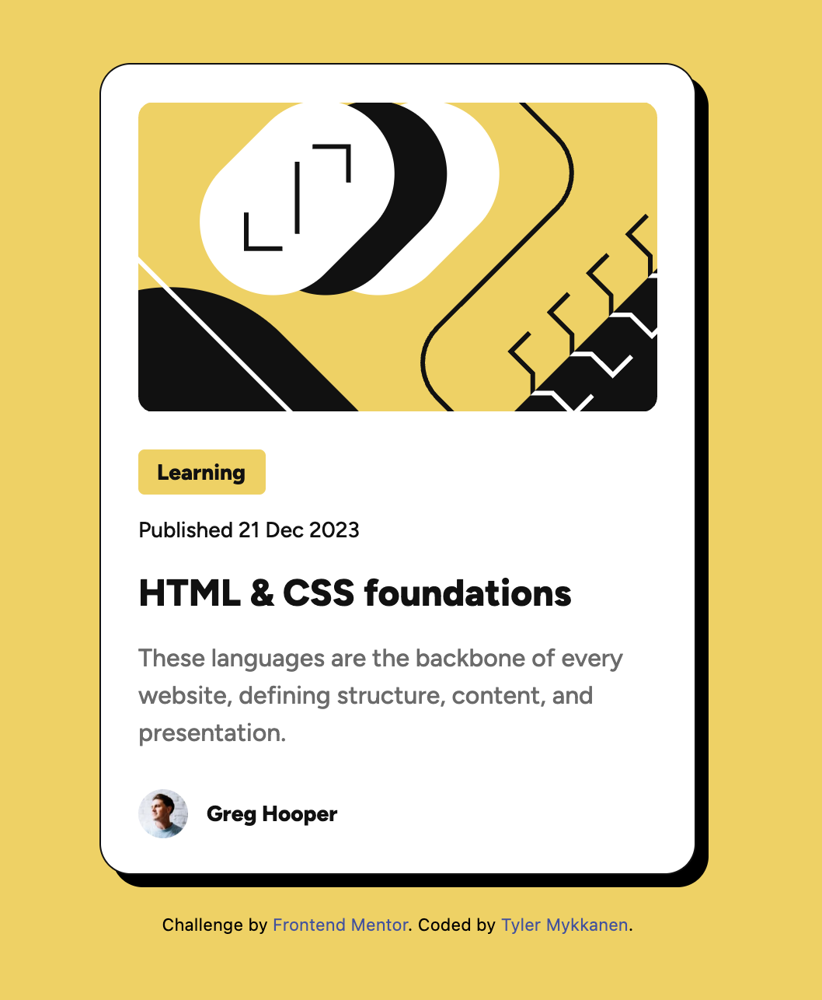

# Frontend Mentor - Blog preview card solution

This is a solution to the [Blog preview card challenge on Frontend Mentor](https://www.frontendmentor.io/challenges/blog-preview-card-ckPaj01IcS). Frontend Mentor challenges help you improve your coding skills by building realistic projects.

## Table of contents

- [Overview](#overview)
  - [The challenge](#the-challenge)
  - [Screenshot](#screenshot)
  - [Links](#links)
- [My process](#my-process)
  - [Built with](#built-with)
  - [What I learned](#what-i-learned)
  - [Continued development](#continued-development)
- [Author](#author)

## Overview

### The challenge

Users should be able to:

- See hover and focus states for all interactive elements on the page

### Screenshot

### Links

- Solution URL: [fm-blog-preview-card-main](https://github.com/tmykkanen/fm-blog-preview-card-main)
- Live Site URL: [tlmfmblogpreviewcard.netlify.app](https://tlmfmblogpreviewcard.netlify.app/)

## My process

1. Set up dev environment w/ pnpm, tailwindcss, and live-server.
2. Set up tailwind component classes for easy font application.
3. Write semantic HTML to scaffold project.
4. Style semantic HTML with tailwind.

### Built with

- 
- 
- 
- 
- 

### What I learned

- I'm most familiar with frameworks with a dev evn already set up. So I learned how to use tailwind cli and set up a live server with hot reloading.
- I read up on some semantic HTML and tried small, figure, etc. rather than divs.
- I looked at several options for animating the drop shadow, including css pseudo elements. I ended up just using keyframe animation with the regular css properties, but the reading helped me understand pseudo elements better.

### Continued development

- I'd like to improve my intuitive understanding of css flex.
- I'd like to continue diving deeper into tailwind best practices (e.g. build components with @apply or style directly with utility classes?).

## Author

- Github - [tmykkanen](https://github.com/tmykkanen)
- Frontend Mentor - [@tmykkanen](https://www.frontendmentor.io/profile/tmykkanen)
